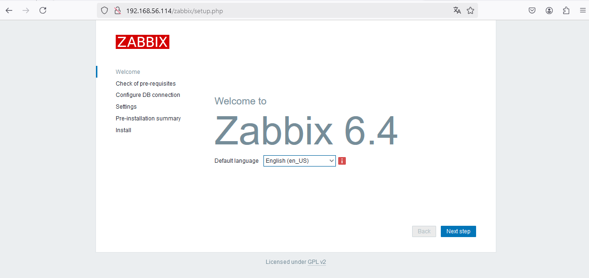
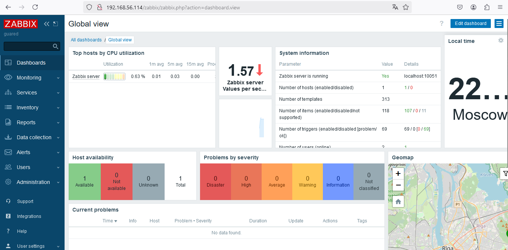
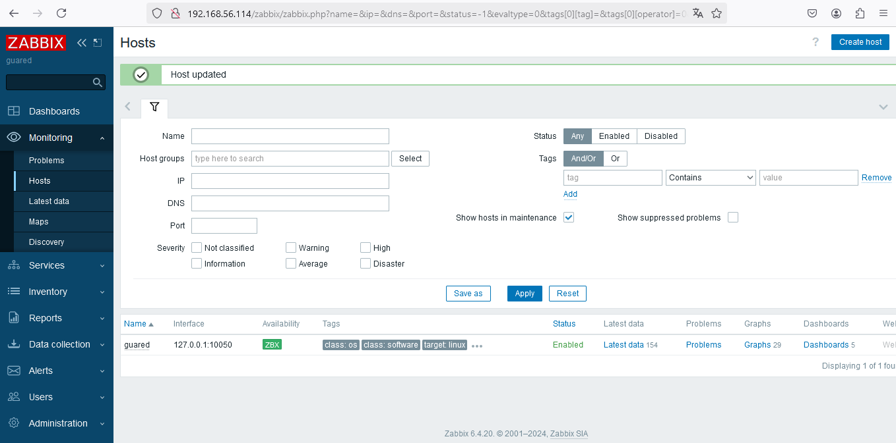
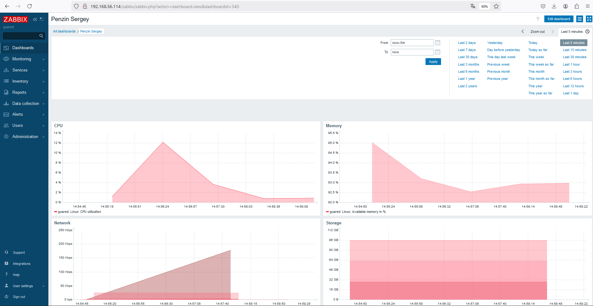

# Настройка мониторинга

## Цель домашнего задания  
Научиться настраивать дашборд.

### Описание домашнего задания  

Что нужно сделать?

Настроить дашборд с 4-мя графиками:   
- память;   
- процессор;   
- диск;   
- сеть.    
Настроить на одной из систем:   
zabbix (использовать screen (комплексный экран);   
prometheus - grafana.   
Использование систем, примеры которых не рассматривались на занятии*   
Список возможных систем был приведен в презентации.    
В качестве результата прислать скриншот экрана - дашборд должен содержать в названии имя приславшего.   

# Выполнение:  
### Дашборд настраивать буду в Zabbix   

# 1. Установка базы данных   
Zabbix требует базу данных для хранения данных. Буду использовать MySQL/MariaDB.   
*действия ниже выполняю от имени пользователя root*   
Установка БД   

```shell
root@ubuntu:~# apt update
root@ubuntu:~# apt install mariadb-server mariadb-client -y
...
Processing triggers for mariadb-server (1:10.11.8-0ubuntu0.24.04.1) ...
Scanning processes...
Scanning linux images...

Running kernel seems to be up-to-date.

No services need to be restarted.

No containers need to be restarted.

No user sessions are running outdated binaries.

No VM guests are running outdated hypervisor (qemu) binaries on this host.   

```    
Настройка безопасности MariaDB    

```shell
root@ubuntu:~# mysql_secure_installation
...
All done!  If you've completed all of the above steps, your MariaDB
installation should now be secure.

Thanks for using MariaDB!

```    
Создание базы данных и пользователя для Zabbix   

```shell
root@ubuntu:~# mysql -u root -p
Enter password:
Welcome to the MariaDB monitor.  Commands end with ; or \g.
Your MariaDB connection id is 35
Server version: 10.11.8-MariaDB-0ubuntu0.24.04.1 Ubuntu 24.04

Copyright (c) 2000, 2018, Oracle, MariaDB Corporation Ab and others.

Type 'help;' or '\h' for help. Type '\c' to clear the current input statement.

MariaDB [(none)]> CREATE DATABASE zabbix CHARACTER SET utf8mb4 COLLATE utf8mb4_bin;
Query OK, 1 row affected (0.001 sec)

MariaDB [(none)]> CREATE USER 'zabbix'@'localhost' IDENTIFIED BY 'your_password';
Query OK, 0 rows affected (0.021 sec)

MariaDB [(none)]> GRANT ALL PRIVILEGES ON zabbix.* TO 'zabbix'@'localhost';
Query OK, 0 rows affected (0.102 sec)

MariaDB [(none)]> FLUSH PRIVILEGES;
Query OK, 0 rows affected (0.001 sec)

MariaDB [(none)]> exit
Bye

```   

# 2. Установка Zabbix Server   

Добавил репозиторий Zabbix   

```shell
root@ubuntu:~# wget https://repo.zabbix.com/zabbix/6.4/ubuntu/pool/main/z/zabbix-release/zabbix-release_6.4-1+ubuntu22.04_all.deb
--2025-01-15 17:15:12--  https://repo.zabbix.com/zabbix/6.4/ubuntu/pool/main/z/zabbix-release/zabbix-release_6.4-1+ubuntu22.04_all.deb
Resolving repo.zabbix.com (repo.zabbix.com)... 178.128.6.101, 2604:a880:2:d0::2062:d001
Connecting to repo.zabbix.com (repo.zabbix.com)|178.128.6.101|:443... connected.
HTTP request sent, awaiting response... 200 OK
Length: 3744 (3.7K) [application/octet-stream]
Saving to: ‘zabbix-release_6.4-1+ubuntu22.04_all.deb’

zabbix-release_6.4-1+ubuntu22.04_a 100%[=============================================================>]   3.66K  --.-KB/s    in 0s

2025-01-15 17:15:13 (493 MB/s) - ‘zabbix-release_6.4-1+ubuntu22.04_all.deb’ saved [3744/3744]

root@ubuntu:~# dpkg -i zabbix-release_6.4-1+ubuntu22.04_all.deb
Selecting previously unselected package zabbix-release.
(Reading database ... 152410 files and directories currently installed.)
Preparing to unpack zabbix-release_6.4-1+ubuntu22.04_all.deb ...
Unpacking zabbix-release (1:6.4-1+ubuntu22.04) ...
Setting up zabbix-release (1:6.4-1+ubuntu22.04) ...

```   

Добавил GPG-ключ Zabbix   

```shell
root@ubuntu:~# wget https://repo.zabbix.com/zabbix-official-repo.key
--2025-01-15 17:30:06--  https://repo.zabbix.com/zabbix-official-repo.key
Resolving repo.zabbix.com (repo.zabbix.com)... 178.128.6.101, 2604:a880:2:d0::2062:d001
Connecting to repo.zabbix.com (repo.zabbix.com)|178.128.6.101|:443... connected.
HTTP request sent, awaiting response... 200 OK
Length: 9033 (8.8K) [application/octet-stream]
Saving to: ‘zabbix-official-repo.key’

zabbix-official-repo.key           100%[=============================================================>]   8.82K  --.-KB/s    in 0s

2025-01-15 17:30:12 (778 MB/s) - ‘zabbix-official-repo.key’ saved [9033/9033]
root@ubuntu:~# apt-key add zabbix-official-repo.key
Warning: apt-key is deprecated. Manage keyring files in trusted.gpg.d instead (see apt-key(8)).
OK

```   
Обновил список пакетов   
Установил Zabbix Server, Frontend и Agent   

```shell
root@ubuntu:~# dpkg -i zabbix-release_6.4-1+ubuntu22.04_all.deb
Selecting previously unselected package zabbix-release.
(Reading database ... 152410 files and directories currently installed.)
Preparing to unpack zabbix-release_6.4-1+ubuntu22.04_all.deb ...
Unpacking zabbix-release (1:6.4-1+ubuntu22.04) ...
Setting up zabbix-release (1:6.4-1+ubuntu22.04) ...
root@ubuntu:~# apt install zabbix-server-mysql zabbix-frontend-php zabbix-apache-conf zabbix-sql-scripts zabbix-agent -y
Reading package lists... Done
Building dependency tree... Done
Reading state information... Done

```   

Импортировал начальную схему и данные в базу данных   

```shell
root@ubuntu:~# zcat /usr/share/zabbix-sql-scripts/mysql/server.sql.gz | mysql -uzabbix -p zabbix
Enter password: gzip: /usr/share/zabbix-sql-scripts/mysql/server.sql.gz: No such file or directory

```   

Перезапустил Zabbix Server и Apache   

```shell
root@guared:~# systemctl restart zabbix-server zabbix-agent apache2
root@guared:~# systemctl enable zabbix-server zabbix-agent apache2
Synchronizing state of zabbix-server.service with SysV service script with /lib/systemd/systemd-sysv-install.
Executing: /lib/systemd/systemd-sysv-install enable zabbix-server
Synchronizing state of zabbix-agent.service with SysV service script with /lib/systemd/systemd-sysv-install.
Executing: /lib/systemd/systemd-sysv-install enable zabbix-agent
Synchronizing state of apache2.service with SysV service script with /lib/systemd/systemd-sysv-install.
Executing: /lib/systemd/systemd-sysv-install enable apache2
Created symlink /etc/systemd/system/multi-user.target.wants/zabbix-server.service → /lib/systemd/system/zabbix-server.service.

```

# 3 Настроил Zabbix Frontend  

   



# 4 Установил и настроил Zabbix Agent. Перезапустил Zabbix   

```shell  

root@guared:~# apt install zabbix-agent
Reading package lists... Done
Building dependency tree... Done
Reading state information... Done
zabbix-agent is already the newest version (1:6.4.20-1+ubuntu22.04).
The following packages were automatically installed and are no longer required:
  augeas-lenses bsdmainutils cpu-checker db-util db5.3-util dctrl-tools debootstrap dkms extlinux fonts-lato guestfish guestfs-tools
  guestmount hfsplus ibverbs-providers icoutils ipxe-qemu ipxe-qemu-256k-compat-efi-roms javascript-common kpartx ldmtool libafflib0v5
  libarchive-tools libaugeas0 libbfio1 libcacard0 libconfig9 libdate-manip-perl libdaxctl1 libdecor-0-0 libdecor-0-plugin-1-cairo
  libdouble-conversion3 libewf2 libfdt1 libfuse2 libgfapi0 libgfrpc0 libgfxdr0 libglusterfs0 libgsoap-2.8.117 libguestfs-hfsplus
  libguestfs-perl libguestfs-reiserfs libguestfs-tools libguestfs-xfs libguestfs0 libhfsp0 libhivex0 libibverbs1 libintl-perl
  libintl-xs-perl libiscsi7 libjs-jquery libldm-1.0-0 liblzf1 libmd4c0 libndctl6 libnetpbm10 libpcre2-16-0 libpmem1 libpmemobj1
  libqt5core5a libqt5dbus5 libqt5gui5 libqt5help5 libqt5network5 libqt5opengl5 libqt5printsupport5 libqt5sql5 libqt5sql5-sqlite
  libqt5svg5 libqt5widgets5 libqt5x11extras5 libqt5xml5 librados2 librbd1 librdmacm1 librpm9 librpmio9 libruby3.0 libsdl-ttf2.0-0
  libsdl1.2debian libsdl2-2.0-0 libslirp0 libspice-server1 libstring-shellquote-perl libsys-virt-perl libtsk19 libusbredirparser1
  libvhdi1 libvirglrenderer1 libvirt0 libvmdk1 libwin-hivex-perl libwpe-1.0-1 libwpebackend-fdo-1.0-1 libxcb-xinerama0 libxcb-xinput0
  libyara8 linux-headers-6.8.0-45-generic linux-hwe-6.8-headers-6.8.0-45 linux-hwe-6.8-tools-6.8.0-45 linux-image-6.8.0-45-generic
  linux-modules-6.8.0-45-generic linux-modules-extra-6.8.0-45-generic linux-tools-6.8.0-45-generic lsscsi msr-tools ncal netpbm
  osinfo-db ovmf qemu-block-extra qemu-system-common qemu-system-data qemu-system-gui qemu-system-x86 qemu-utils qt5-gtk-platformtheme
  qttranslations5-l10n racc rake rpm-common ruby ruby-bcrypt-pbkdf ruby-builder ruby-childprocess ruby-concurrent ruby-ed25519
  ruby-erubi ruby-excon ruby-ffi ruby-fog-core ruby-fog-json ruby-fog-libvirt ruby-fog-xml ruby-formatador ruby-i18n ruby-libvirt
  ruby-listen ruby-log4r ruby-mime-types ruby-mime-types-data ruby-mini-portile2 ruby-multi-json ruby-net-scp ruby-net-sftp
  ruby-net-ssh ruby-net-telnet ruby-nokogiri ruby-oj ruby-pkg-config ruby-rb-inotify ruby-rubygems ruby-vagrant-cloud ruby-webrick
  ruby-xmlrpc ruby-zip ruby3.0 rubygems-integration scrub seabios sleuthkit supermin syslinux syslinux-common vagrant-libvirt virt-p2v
  virtualbox virtualbox-dkms virtualbox-qt
Use 'sudo apt autoremove' to remove them.
0 upgraded, 0 newly installed, 0 to remove and 0 not upgraded.

```   
root@guared:~# sudo nano /etc/zabbix/zabbix_agentd.conf

```shell  

root@guared:~# systemctl restart zabbix-agent
root@guared:~# systemctl enable zabbix-agent
Synchronizing state of zabbix-agent.service with SysV service script with /lib/systemd/systemd-sysv-install.
Executing: /lib/systemd/systemd-sysv-install enable zabbix-agent

```


# 5. Добавил хост в Zabbix  

   

# 6. Проверка работы   
 

   

# 7. Создание дашборда и вывод графиков    



______________   
end